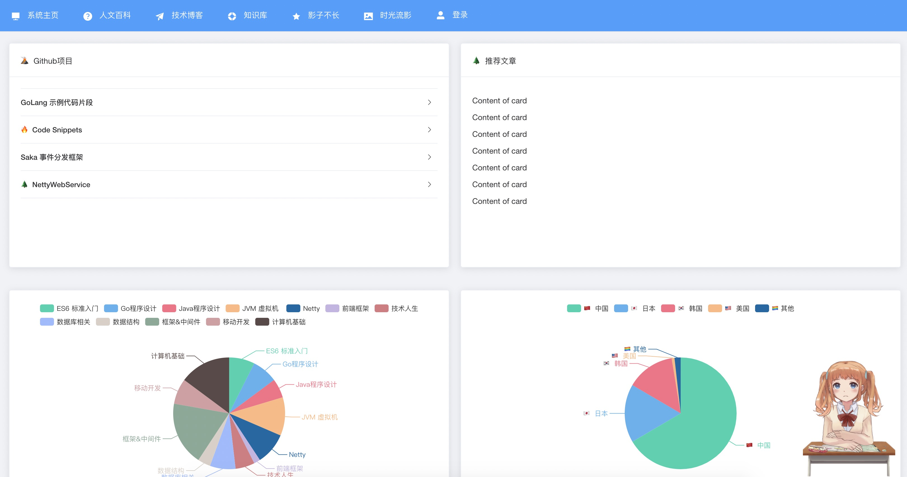
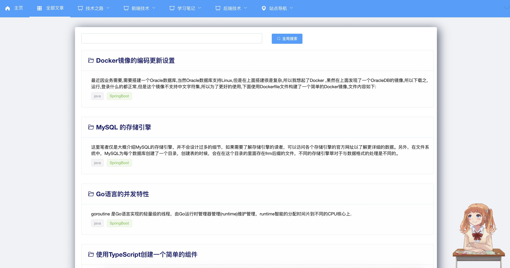
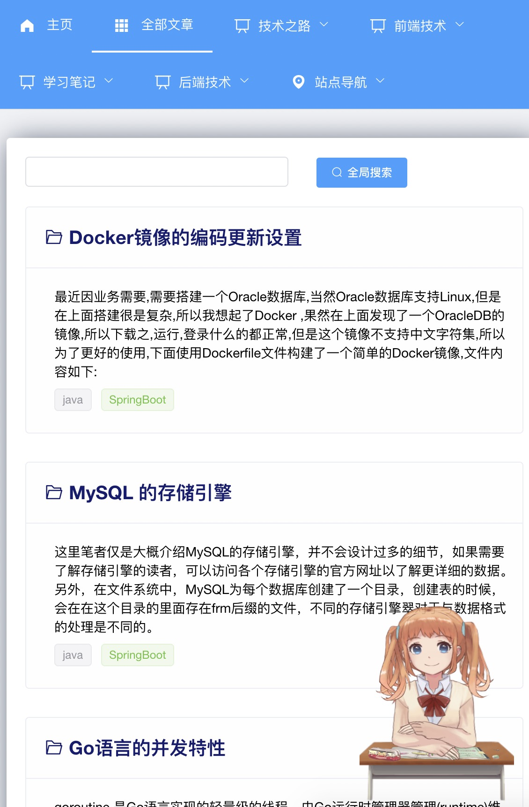
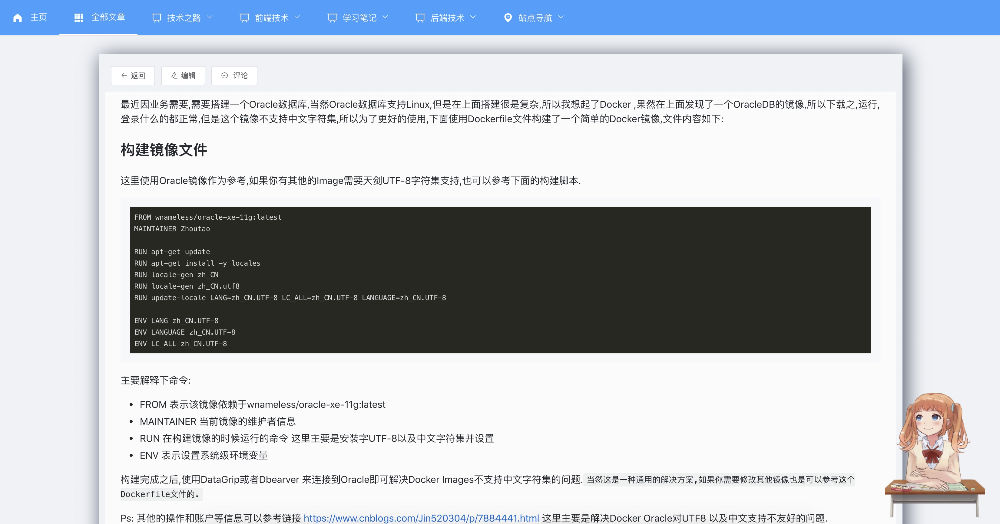

# 项目说明

个人基于VUE实现的博客系统，后端使用Java开发的系统，非大众化博客平台，设计个人需求的博客系统 [地址 https://www.zhoutao123.com](https://www.zhoutao123.com)


## 使用方法

安装最新版本的NodeJS，克隆代码并且安装依赖

```shell script
+ git clone https://github.com/zhou-seven/SevenBlog.git
+ sudo npm -g yarn
+ yarn install
+ yarn serve
```

访问http://localhost:3000


## 技术栈

### 前端
+ VUE
+ Vuex
+ Vue Router
+ JavaScript(后期准备使用TypeScript重构)

### 后端
+ Java8
+ MyBatisPlus
+ SpringBoot2.x
+ Mysql 5.7

## 预览界面

> 预览界面有部分仍未完成，实际进度以个人网站为准 [https://www.zhoutao123.com](https://www.zhoutao123.com)

### 首页



### 博客首页



### 首页适应手机



### 博文详情



### Customize configuration
See [Configuration Reference](https://cli.vuejs.org/config/).
