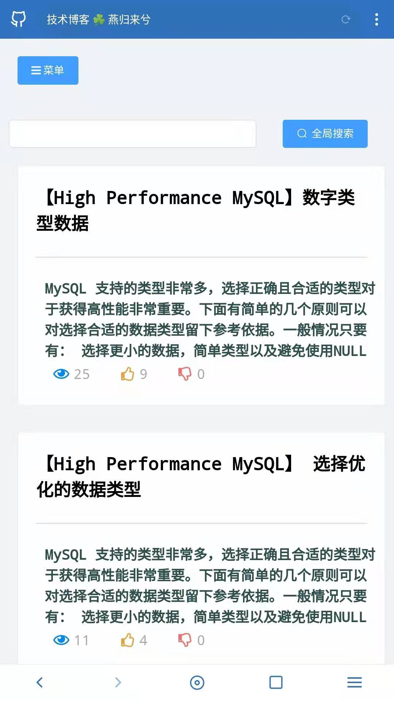
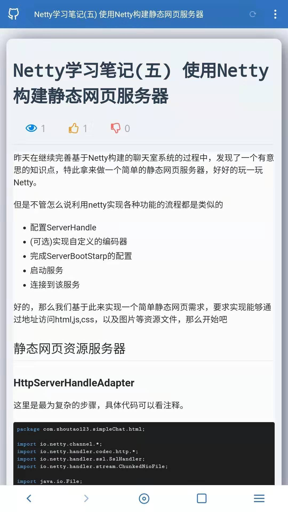

# 项目说明

个人基于VUE实现的博客系统，后端使用Java开发的系统，非大众化博客平台，设计个人需求的博客系统 [地址 https://www.zhoutao123.com](https://www.zhoutao123.com),

后端仓库地址: [SevenBlog-BackEnd](https://github.com/taoes/SevenBlog-BackEnd)

# Github

+ [✅ 前端仓库地址](https://github.com/zhou-seven/SevenBlog-FrontEnd)
+ [✅ 后端仓库地址](https://github.com/zhou-seven/SevenBlog-BackEnd)


## 使用方法

安装最新版本的NodeJS，克隆代码并且安装依赖

```shell script
+ git clone https://github.com/zhou-seven/SevenBlog.git
+ sudo npm install yarn -g
+ yarn install
+ yarn serve
```

访问http://localhost:3000


## 技术栈

### 前端
- [x] VUE
- [x] Vuex
- [x] Vue Router
- [x] JavaScript(后期使用TypeScript重构)

### 后端
- [x] Java8
- [x] Gradle
- [x] MyBatis-Plus
- [x] SpringBoot2.x
- [x] Mysql 5.7
- [x] Redis Cache


## 移动版预览

#### 博客列表

<div style="text-align: center">

</div>
---

<div style="text-align: center">

</div>
#### 侧边菜单

<div style="text-align: center">

</div>
#### 博文详情

<div style="text-align: center">

</div>

## PC预览界面

> 预览界面有部分仍未完成，实际进度以个人网站为准 [https://www.zhoutao123.com](https://www.zhoutao123.com)

#### 首页(部分完成)


#### 博客首页


#### 博文详情


#### 文章管理


### Customize configuration
See [Configuration Reference](https://cli.vuejs.org/config/).
